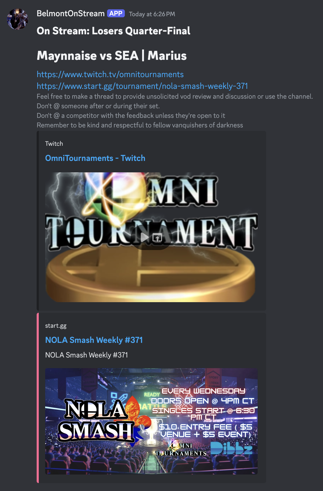
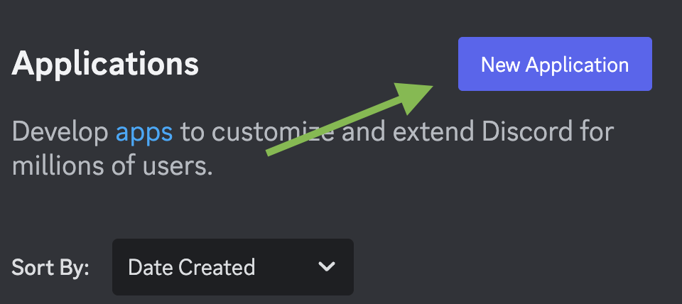
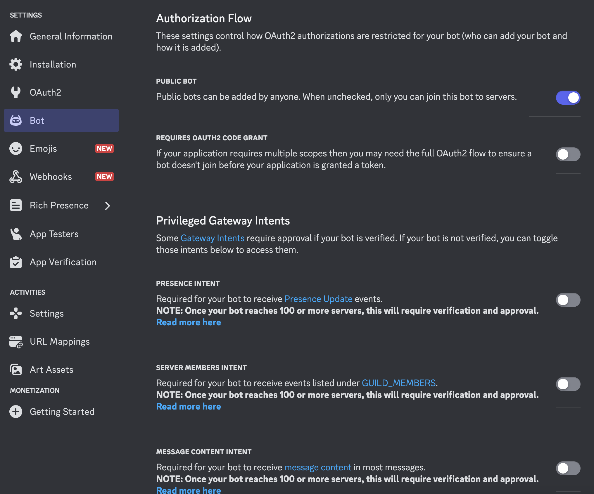
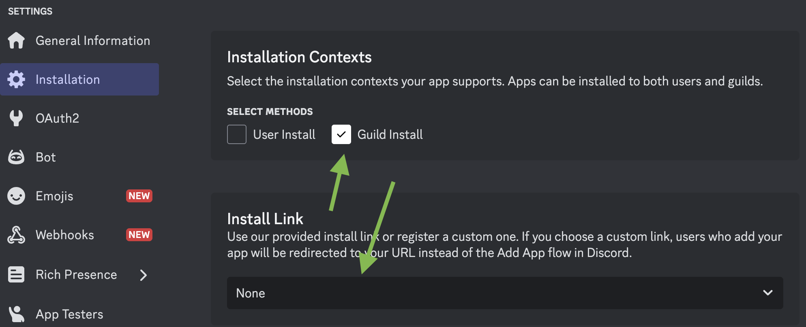
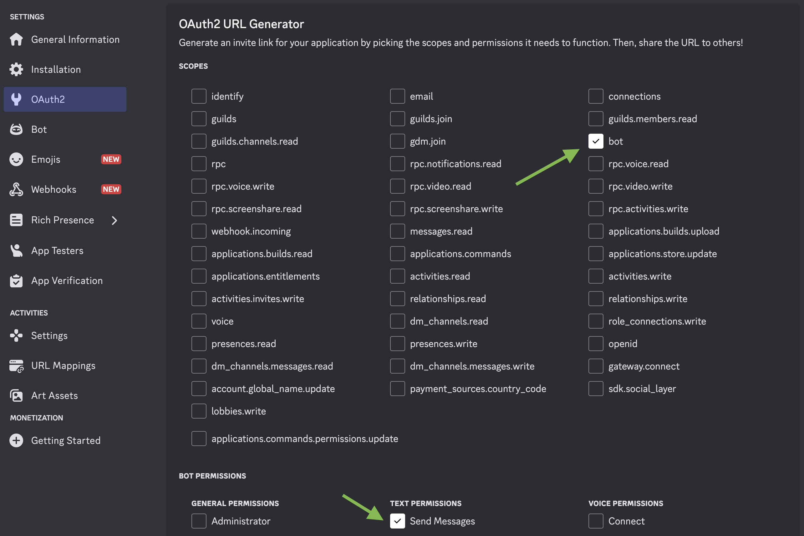
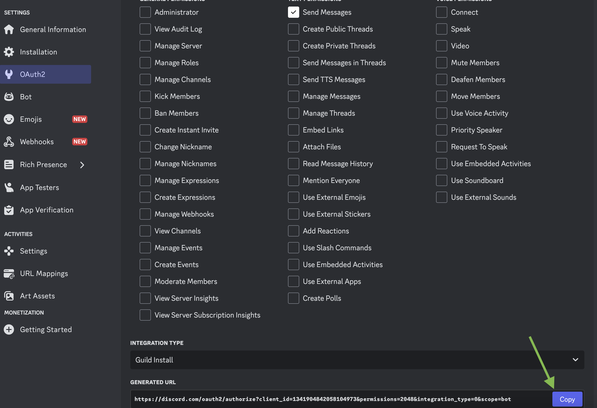

# UsersOnStreamBot
The bot periodically checks start.gg sets for a list of users and sends a discord message when a new one is on stream.

## Example output message:




## setup:
To download python packages, run:

```python3 setup.py```

In `userSlugs.json` Add slugs in the format `"label": "slug"` where label is anything and slug is the slug from the url on the users page in start.gg e.g. `https://www.start.gg/user/{slug}/details`

Add start.gg api key and discord bot tokens in `config.json`

discord channel id can be found from copying the link by right-clicking on a channel or similar
https://discord.com/channels/{discordServerId}/{discordChannelId}

start.gg developer documentation and where you can create an account and get a token:
https://developer.start.gg/docs/intro/

discord applications site for creating a bot:
https://discord.com/developers/applications

At time of writing, you can setup the discord bot like this, with a guild install and only "Send Messages" permission 















